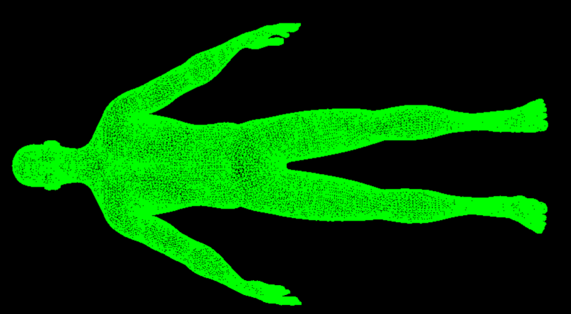

## Hi, I'm CortexR7

I like understanding things in depth.
Physics and mathematics, low-level programming, computer graphics.

Currently focused on **GPU programming with Vulkan**: how modern graphics
pipelines work and how software interacts with GPU hardware.

  

